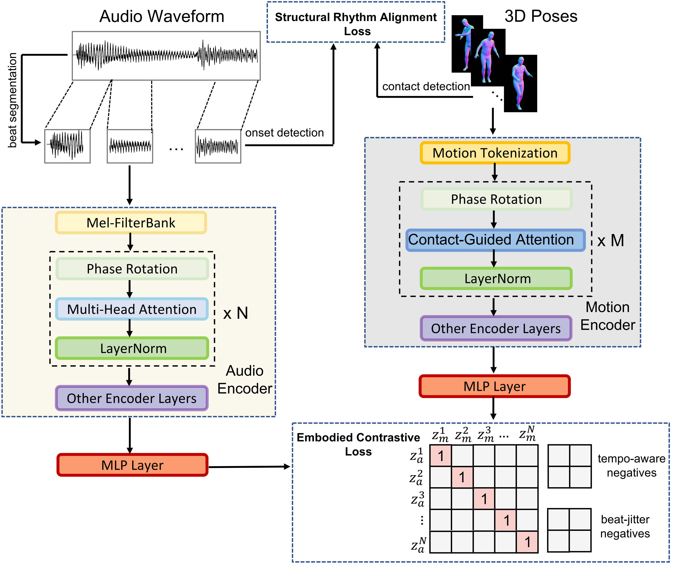

<p align="center">
<h1 align="center">  MotionBeat: Motion-Aligned Music Representation via Embodied Contrastive Learning and Bar-Equivariant Contact-Aware Encoding</h1>
</p>

<div align="center">

[**Xuanchen Wang**](https://scholar.google.com/citations?user=H356FF8AAAAJ&hl=en)<sup></sup> · [**Heng Wang**](https://scholar.google.com.au/citations?user=jPj4ViQAAAAJ&hl=en&oi=ao)<sup></sup> ·   [**Weidong Cai**](https://scholar.google.com.au/citations?user=N8qTc2AAAAAJ&hl=en&oi=ao)<sup></sup>

School of Computer Science, The University of Sydney


<a href='https://motionbeat2025.github.io/'></a>
<a href=''></a>

</div>


## Framework

<p align="center">
  
</p>


## Reference
If you find this project useful for your research, please consider citing the following paper:

```
@article{wang2025musicweaver,
  title={MusicWeaver: Coherent Long-Range and Editable Music Generation from a Beat-Aligned Structural Plan},
  author={Wang, Xuanchen and Wang, Heng and Cai, Weidong},
  journal={arXiv preprint arXiv:2509.21714},
  year={2025}
}
